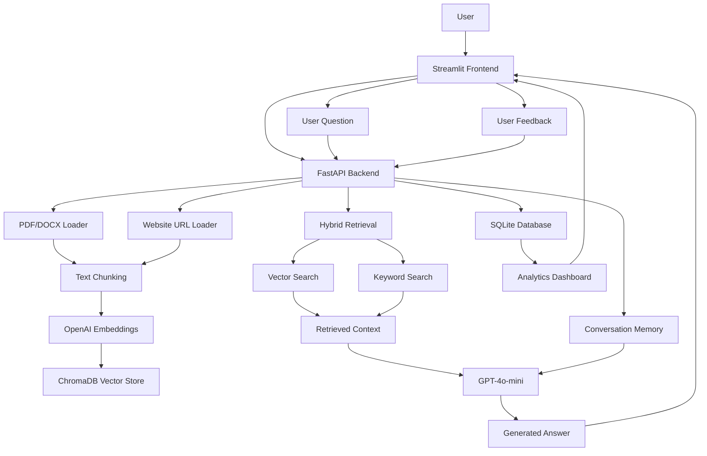

# Architecture



---

## Deployment Architecture

```text
                ┌─────────────────┐
                │      User       │
                └────────┬────────┘
                         │
                         ▼
                ┌─────────────────┐
                │ Streamlit UI    │
                │ Docker Service  │
                └────────┬────────┘
                         │ HTTP
                         ▼
                ┌─────────────────┐
                │ FastAPI Backend │
                │ Docker Service  │
                └─────┬─────┬─────┘
                      │     │
                      │     ▼
                      │  SQLite
                      │ Analytics
                      │
                      ▼
                 ChromaDB
                 Vector DB
                      │
                      ▼
                 OpenAI API
```

---

## Evaluation Flow

```text
Sample Document
       │
       ▼
 Upload & Index
       │
       ▼
    ChromaDB


eval_questions.json
       │
       ▼
   run_evals.py
       │
       ▼
 FastAPI /ask API
       │
       ▼
 Retrieved Answers
       │
       ▼
 Pass / Fail Metrics
```

---

## System Flow

1. User uploads a PDF/DOCX document or enters a website URL.
2. Streamlit sends the request to FastAPI.
3. FastAPI extracts content using the PDF/DOCX loader or Website URL loader.
4. Content is split into chunks.
5. Chunks are converted into embeddings using OpenAI Embeddings.
6. Embeddings and metadata are stored in ChromaDB.
7. User submits a question through the chat interface.
8. FastAPI performs hybrid retrieval using both vector search and keyword search.
9. Retrieved context is combined with conversation memory.
10. GPT-4o-mini generates a grounded response using retrieved context.
11. The answer is returned to Streamlit with source citations.
12. Users can provide feedback on generated responses.
13. Feedback is stored in SQLite.
14. Analytics are displayed through the dashboard.

---

## Retrieval Strategy

The system uses a hybrid retrieval architecture to improve answer quality and reduce retrieval failures.

### Semantic Retrieval

* OpenAI Embeddings (`text-embedding-3-small`)
* ChromaDB vector similarity search

Benefits:

* Understands semantic meaning
* Handles paraphrased questions
* Retrieves contextually relevant chunks

### Keyword Retrieval

* Exact keyword matching across indexed chunks

Benefits:

* Captures technical terms
* Handles IDs, names, and document-specific phrases
* Improves precision for structured documents

### Hybrid Search Workflow

1. Execute vector similarity search.
2. Execute keyword search.
3. Merge and deduplicate results.
4. Pass retrieved context to GPT-4o-mini.
5. Generate a source-grounded answer.

This approach provides better accuracy than relying solely on vector search or keyword search alone.
