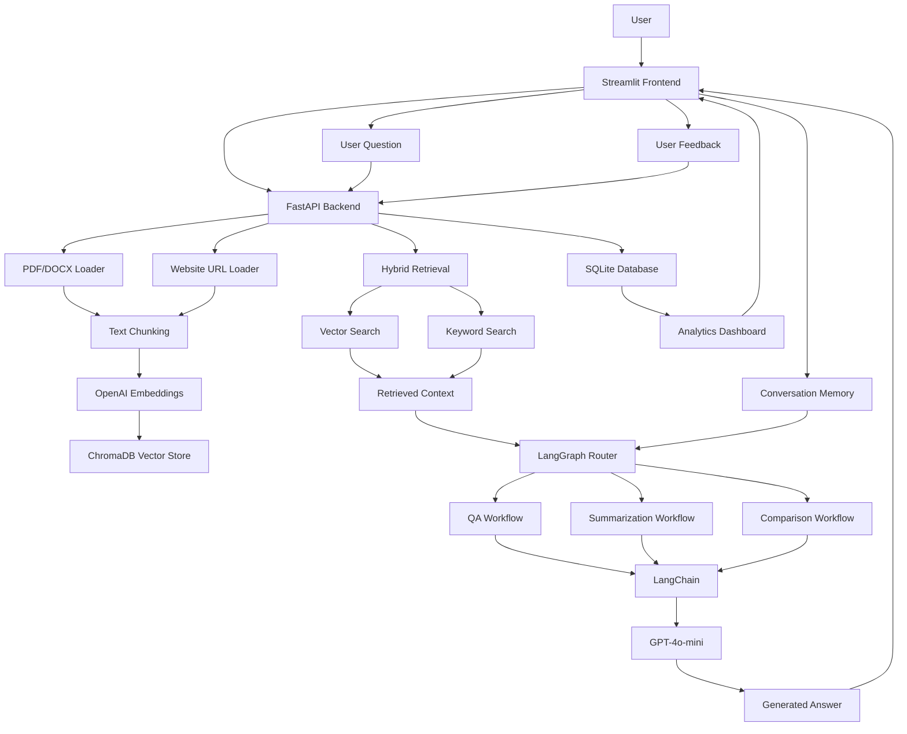

# Architecture

## System Architecture



---

## Deployment Architecture

```text
                ┌─────────────────┐
                │      User       │
                └────────┬────────┘
                         │
                         ▼
                ┌─────────────────┐
                │ Streamlit UI    │
                │ Docker Service  │
                └────────┬────────┘
                         │ HTTP
                         ▼
                ┌─────────────────┐
                │ FastAPI Backend │
                │ Docker Service  │
                └─────┬─────┬─────┘
                      │     │
                      │     ▼
                      │  SQLite
                      │ Analytics
                      │
                      ▼
                 ChromaDB
                 Vector DB
                      │
                      ▼
                 OpenAI API
```

---

## Evaluation Flow

```text
                    Sample Document
                           │
                           ▼
                    Upload & Index
                           │
                           ▼
                        ChromaDB
                           ▲
                           │
                eval_questions.json
                           │
                           ▼
                      run_evals.py
                           │
                           ▼
                    FastAPI /ask API
                           │
                           ▼
                    Generated Answers
                           │
                           ▼
                    Pass / Fail Metrics
```

---

## Sample Evaluation Framework

The project includes a lightweight evaluation framework for validating retrieval and answer generation behavior.

Components:

- `evals/eval_questions.json`
  - Sample benchmark questions and expected keywords

- `evals/run_evals.py`
  - Automated evaluation runner

- Sample documents
  - Used to validate retrieval behavior

The evaluation framework helps verify that changes to the retrieval pipeline continue to produce expected answers for known test cases.

Current benchmark result:

```text
3/3 Questions Passed
```

---

## System Flow

1. User uploads a PDF/DOCX document or enters a website URL.
2. Streamlit sends the request to FastAPI.
3. FastAPI extracts content using the PDF/DOCX loader or Website URL loader.
4. Content is split into chunks.
5. Chunks are converted into embeddings using OpenAI Embeddings.
6. Embeddings and metadata are stored in ChromaDB.
7. User submits a query through the chat interface.
8. FastAPI performs hybrid retrieval using both vector search and keyword search.
9. Retrieved context is combined with conversation memory.
10. LangGraph routes the request to the appropriate workflow:
    - Question Answering
    - Document Summarization
    - Document Comparison
11. LangChain constructs the prompt and orchestrates the LLM call.
12. GPT-4o-mini generates a grounded response using retrieved context.
13. The answer is returned to Streamlit.
14. Users can provide feedback on generated responses.
15. Feedback is stored in SQLite.
16. Analytics are displayed through the dashboard.

---

## Retrieval Strategy

The system uses a hybrid retrieval architecture to improve answer quality and reduce retrieval failures.

### Semantic Retrieval

- OpenAI Embeddings (`text-embedding-3-small`)
- ChromaDB vector similarity search

Benefits:

- Understands semantic meaning
- Handles paraphrased questions
- Retrieves contextually relevant chunks

### Keyword Retrieval

- Exact keyword matching across indexed chunks

Benefits:

- Captures technical terms
- Handles IDs, names, and document-specific phrases
- Improves precision for structured documents

### Hybrid Search Workflow

1. Execute vector similarity search.
2. Execute keyword search.
3. Merge and deduplicate results.
4. Pass retrieved context and conversation memory to LangGraph.
5. Route the request to the appropriate workflow:
   - Question Answering
   - Document Summarization
   - Document Comparison
6. Use LangChain to build the prompt and invoke GPT-4o-mini.
7. Generate a source-grounded response.

This approach provides better accuracy than relying solely on vector search or keyword search alone and enables agentic workflow routing on top of the RAG pipeline.

---

## Agentic Workflow

The application uses LangGraph to route user requests into specialized workflows instead of treating every request as a simple question-answering task.

### Supported Workflows

#### Question Answering

Handles factual questions grounded in uploaded documents.

Examples:

- What is the repayment period?
- What is the interest rate?

#### Document Summarization

Generates summaries of uploaded documents.

Examples:

- Summarize this document.
- Give me a brief overview.

#### Document Comparison

Compares information across one or more uploaded documents.

Examples:

- Compare repayment period and moratorium period.
- Compare the uploaded documents.

### Benefits

- Supports multiple document interaction patterns
- Keeps workflow logic modular
- Makes the RAG system easier to extend
- Provides a foundation for future tool-using agents