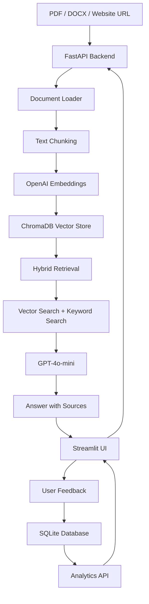

# Architecture



## Deployment Architecture

```text
User
 │
 ▼
Streamlit Frontend (Docker)
 │
 ▼
FastAPI Backend (Docker)
 │
 ├── OpenAI API
 │
 ├── ChromaDB
 │
 └── SQLite Analytics
```

## System Flow

1. User uploads a PDF/DOCX file or enters a website URL.
2. Streamlit sends the request to FastAPI.
3. FastAPI extracts document text using the document loader.
4. Text is split into chunks.
5. Chunks are embedded using OpenAI embeddings.
6. Embeddings and metadata are stored in ChromaDB.
7. User asks a question through Streamlit.
8. FastAPI performs hybrid retrieval using vector search and keyword search.
9. Retrieved context is passed to GPT-4o-mini.
10. The answer is returned to Streamlit.
11. User feedback is stored in SQLite.
12. Analytics are displayed in the dashboard.